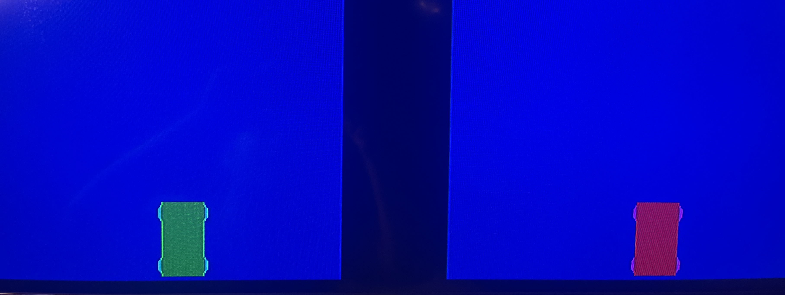

# Final Project: Two Player Racing Game

## Expected Behaviors

* The goal of our project was to create a top down racing game where users dodge obstacles
  * One user should be able to move left and right controlling an individual car using the Nexys Board controller
  * The other user should be able to move left and right controlling an individual car using the Keypad controller
  * There should be random falling obstacles that the user needs to avoid with increasing difficulty
  * There should be a score counter for each player
  * There should be a penalty if you hit an obstacle
  * There should be a win scenario
 
## Necessary Equipment

* [Nexys A7-100T FPGA Board](https://digilent.com/shop/nexys-a7-fpga-trainer-board-recommended-for-ece-curriculum/)
* Computer with *[Vivado](https://www.xilinx.com/products/design-tools/vivado.html)* installed
* Micro-USB Cable
* VGA Cable
* Monitor/TV with VGA input or VGA adapter
* [PMOD KYPD](https://digilent.com/shop/pmod-kypd-16-button-keypad/)

## Code Modules Overview

* The **_[cardrive.vhd](CarGame/cardrive.vhd)_** is our top hierarchy file
  * Not many chages were made here from the original [pong.vhd](https://github.com/byett/dsd/tree/CPE487-Spring2025/Nexys-A7/Lab-6/pong.vhd)
  * We added the PMOD KYPD here and made it so that the buttons 6 and 3 controlled the left right for our car 2
  * We split up the 7 segment display by mapping our two scres to the left and right 4 segments respectively
  * Set the bounds for each player and the ball in this file
  * Initialized all our pins and determined their values
 
* The **_[cardrive.xdc](CarGame/cardrive.xdc)_** is where we established all the pins that we planned to use for control
  * The only thing we needed to really add here was the full keypad matrix which was 4 columns and 4 rows of pins 

* The **_[car_n_obstacles.vhd](CarGame/car_n_obstacles)_** has the most additions and changes, these changes include:
  * A wall draw process
  * Duplicated the ball draw function
  * A secondary car drawing process
  * A wheel drawing function that works with our 2 car drawing functions so they actually look like cars
  * Change mball to reset the ball, increase its speed, raise and lower our hit counters and randomize the balls x position
  * Developed a linear-feedback shift register to simulate random ball spawning positons on the x-axis
  * Set our colors for all entities

* The **_[leddec16.vhd](CarGame/leddec16.vhd)_** controls the 7 segment display and what drives each display
  * The changes made to this file revolve around seperating segments 0-3 and 4-7
  * We used two 16 bit logic vectors data and data2 to determine what score to show and where
  * Dig controls what digit to display
  * Seg converts the given digit to its corresponding hex value 

* The **_[clk_wiz_0](CarGame/clk_wiz_0.vhd)_** and **_[clk_wiz_0_clk_wiz](CarGame/clk_wiz_0_clk_wiz.vhd)_** modules were taken from the [given code for Lab 6](https://github.com/byett/dsd/tree/CPE487-Spring2025/Nexys-A7/Lab-6) and left unmodified.
  * These modules control the clock processes of the Nexys A7 board.
 
* The **_[vga_sync](CarGame/vga_sync.vhd)_** module (also given and unmodified) uses a clock to drive horizontal and vertical counters h_cnt and v_cnt, respectively.
  * These counters are then used to generate the various timing signals.
  * The vertical and horizontal sync waveforms, vsync and hsync, will go directly to the VGA display with the column and row address, pixel_col and pixel_row, of the current pixel being displayed.
  * This module also takes as input the current red, green, and blue video data and gates it with a signal called video_on.
  * This ensures that no video is sent to the display during the sync and blanking periods.

## Modifications Made

### Cardrive.vhd

* Changed entity name from 'pong' to 'cardrive.'
* Added KB_row OUT and kb_col INOUT to entity cardrive.
* Initialized car2pos to CONV_STD_LOGIC_VECTOR(650, 11) to set it on the right side of the barrier for player 2.
* Initialized display and display2 for the scores of each player to display.
* Initialized kb_row_signal, kb_col_signal, kp_value, and data_sel for the keypad functions.
* Changed component name from 'bat_n_ball' to 'car_n_obstacles.'
* Added car2_x IN, hit_cnt INOUT and hit_cnt2 INOUT to component car_n_obstacles.
* Added data and data2 to component leddec16.
* In the pos process, changed the limits of where the first car can go from 0,800 to 20,305.
* In the pos process, added similar logic for car2pos but changed the limit from where car2 can go to 500,775. We also added logic to incorporate hitting the correct buttons by setting kb_row_signal <= "1011" and in the if statements, also check to see if KB_col(1) = '0' and KB_col(2)= '0.' This allows for buttons 6 and 3 to be pressed as the left and right movement keys.
* Set kb_row <= kb_row_signal to ensure that kb_row was "1011', which corresponds to row 3 on the keypad.
* In the portmap of car_n_obstacles, hit_cnt => display, set hit_cnt2 => display2 and car2_x => car2pos.
* In the portmap of leddec16, set data => display and data2 => display2.

### Cardrive.xdc

* This constraint file was modified to incorporate the use of the key pad.
* To incorporate the key pad, we directly copied in the appropriate peroperities and pins from the hex calculator lab. [hexcalc.xdc](https://github.com/byett/dsd/blob/9a72b6299abd0093ced6b22adff2ac72ab6343f5/Nexys-A7/Lab-4/hexcalc.xdc#L17-L24)

### car_n_obstacles.vhd

* Changed entity name from 'bat_n_ball' to 'car_n_obstacles.'
* Added car2_x IN and hit_cnt2 INOUT to entity car_n_obstacles.
* Initialized hit_check2 and set it equal to '0.'
* Set constant bsize to 16 instead of 8 to make the game harder (the ball will be bigger and thus harder to avoid).
* Initlized constant wheelsize and set it equal to 10.
* Initialized signal car2_w and set it equal to 20 and constant car2_h and set it equal to 35. These are the same perameters for the first car.
* Initialized lfsr and lfsr2 and set the whole 11 bit vector to '1'.
* Initialized signals counter, randomx, ball2_speed, wheel_on ='0', car2wheel_on ='0', ball2_on, and car2_on.
* Modified ball_x and ball_y from 400,11 and 300,11 to 200,11 and 10,11 
* Initialized ball2_x and set it to 650,11 and ball2_y and set it to 10,11.
* Initialized wheel1_x , wheel1_y and did the same for the other 3 wheels.
* Initialized car2wheel1_x, car2wheel1_y and did the same for the other 3 wheels.
* Initialized car2_y and set it to 550, 11.
* Initialized ball2_x_motion and ball2_y_motion. Note: Ball2_x_motion was not used in this code.
* Initialized wall_right_on, wall_left_on, wall_fill, wall_bottom and set them all equal to '0'.
* Set red <= car_2on or car2wheel_on so car2 will be red with red wheels.
* Set green <= bat_on or wheel_on so car1 will be green with green wheels.
* set blue <= not (ball_on or ball2_on or bat_on or car2_on or wall_left_on or wall_right_on or wall_fill or wall_bottom) so all of these named elements will be black.
* Everything unnamed will be blue (background).

Processes:

1. [balldraw2](https://github.com/Tuki260/DSD-Project/blob/06af8537e8eea8a547f3728049de778f9989fe7e/CarGame/car_n_obstacles.vhd#L96-L114)
* Very similar to the original bat_n_ball's balldraw.
* Only difference is the change in variables such as ball2_x, ball2_y, ball2_on, v2x, and v2y.
2. [walldraw](https://github.com/Tuki260/DSD-Project/blob/06af8537e8eea8a547f3728049de778f9989fe7e/CarGame/car_n_obstacles.vhd#L116-L141)
* This process creates the barrier in the middle of the screen as well as the barrier floor.
* Creates a vertical line, wall_left_on, at pixel_col = 350.
* Creates another vertical line, wall_right_on, at pixel_col = 450.
* Creates a vertical rectangular fill between these walls from pixelcol = 351 - 449.
* Creates a horizontal rectangular floor between pixel_row 590 and 600
3. [batdraw](https://github.com/Tuki260/DSD-Project/blob/06af8537e8eea8a547f3728049de778f9989fe7e/CarGame/car_n_obstacles.vhd#L146-L165)
* This process draws how the first car should look.
* The difference from the original code has to do with the implementation of the wheels.
* In this process, the location of the wheels are determined. For example, the first wheel's position is determined by wheel1_x and wheel1_y. Wheel1_x <= bat_x + 14, so 14 pixels to the right of the car. Wheel1_y <= bat_y + 25, so 25 pixels above the car. Together, these make the first wheel, and when looking at it from above, is the front right tire.
* This process is done for all 4 of the wheels.
4. [wheeldraw](https://github.com/Tuki260/DSD-Project/blob/06af8537e8eea8a547f3728049de778f9989fe7e/CarGame/car_n_obstacles.vhd#L167-L238)
* Uses a similar process of creating a ball from the original Pong Lab.
* Creates a ball of size "wheel-size" at uninitialized "wheel_x" and "wheel_y".
* The wheel_x and wheel_y is initialized in the "batdraw" process to create the wheel relative to where the car is currently located.
5. [car2wheeldraw](https://github.com/Tuki260/DSD-Project/blob/06af8537e8eea8a547f3728049de778f9989fe7e/CarGame/car_n_obstacles.vhd#L240-L311)
*Exact same logic as wheeldraw, except the positions are located relative to car2.
6. [car2draw](https://github.com/Tuki260/DSD-Project/blob/06af8537e8eea8a547f3728049de778f9989fe7e/CarGame/car_n_obstacles.vhd#L313-L332)
* This process draws how the second car should look.
* car2draw involves the same logic as batdraw, but with the variables related to car2 (car2_x, car2_on, car2wheels).
7. [mball](https://github.com/Tuki260/DSD-Project/blob/06af8537e8eea8a547f3728049de778f9989fe7e/CarGame/car_n_obstacles.vhd#L336-L469)
* This process is responsible for the movement of the balls. 
* Initialized variables for std_logic_vectors: temp, temp2 and integers: rnd_int, rnd_int2.
* Randomizer stufff LINES 342-352 *NEEDS EDITING*
* Also modified from the original code, all operations that changed the speed of ball_x_motion were deleted so there is no horizontal movement, only vertical movement.
* The general ball movement logic is that when the game is started, the ball starts to move.
* If the ball meets the bottom wall with no collision, it will speed up by 6 when it respawns at the top. When we did this originally, the ball hitting the bottom would register multiple times. To remedy this, we used the variable hit_check as a flag to make sure the ball will only be registered to hit once and only increase the speed once.
* If the ball hit the car, the car's speed would go down by 2.
* This logic for the first ball was replicated for the second ball using ball2 variables with hit_cnt_2 and hit_check2.
* Temp stuff LINES 431+ *NEEDS EDITING*

### leddec16.vhd

* Added data2 into entity leddec16 for car2.
* In addition to data4 <= data, we set data4 <= data2 aswell when dig was 100 - 111.
* We also uncommented the bottom 4 lines of code under anode to incorporate the left 4 displays on the 7-segment display.
* This code now displays player 2's score on the left and player 1's score on the right four segments of the 7-segment display.

## Heirarchy of the code:

## Input/Output Description

## How to make this work in vivado

### Hardware:

* On the Nexys A7 board, connect the VGA port (Red) to the monitor you want to display the game on. Connect the USB port (Blue) to your computer that is running the code. Turn the power on by hitting the power switch (Purple). Connect the key pad to the side port (yellow) and make sure the gnd from the key pad is matched up with the board's gnd.

### In Vivado:
* Start a new RTL project called CarGame
* Create six new source files: car_n_obstacles, cardrive, clk_wiz_0, clk_wiz_0_clk_wiz, leddec16, vga_sync and one constraint file: cardrive. Choose the Nexys A7-100T board and hit 'Finish.'
* From this github, copy and paste the corresponding code into the file on vivado.
* Once all of the files are up to date, make sure they are all saved.
* Run sythesis
* Run implementaiton
* Click 'Generate Bitstream'
* Click 'Open Hardware Manager' -> 'Open Target' -> 'Auto Connect'
* Click 'Program Device' then  xc7a100t_0 to download cargame.bit to the board.
* Grab someone to play with and push BTNC to start playing. 

## Gameplay Summary

## Difficulties and Itterations

## Contributions

Note: For almost every feature / mechanic, we worked on it as a group instead of each doing each thing individually. We sorted the contributions below based on who's ideas and inputs worked the best for each fature.

Anthony:
* Car graphics and dimensions (not wheels)
* Car and ball boundaries
* Graphics of the boundaries
* Implementing keypad
* Added to README

Jaelin: 

* Wheel Boundaries
* Wheel Dimensions/Graphics
* Colors
* Debugging/Creating Alternate "Test" Codes to implement new features

Salvatore: *Needs Editing*

* 

